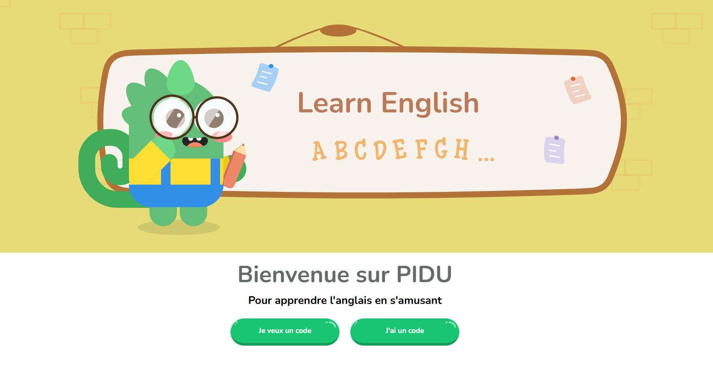

# 🧠 Pidu - Application éducative pour apprendre l’anglais

**Pidu** est une application éducative interactive destinée aux enfants pour les aider à **apprendre l’anglais de manière ludique** 🎯  
Elle permet à chaque utilisateur de suivre sa progression, de personnaliser son profil et de jouer à travers différentes activités sonores et visuelles.

---

## 🌟 Présentation du projet

Ce projet a été réalisé dans le cadre de mon stage avec [Maryline Lesaffre](https://github.com/) et sous la supervision de [Laurent Heneman](https://github.com/).  
L’objectif de **Pidu** est d’offrir une **expérience d’apprentissage immersive et personnalisée** grâce à une interface moderne, des sons et des animations adaptées aux enfants.

### 🎨 Réalisation des maquettes
Les maquettes ont été conçues avec **Figma**, permettant de définir une identité visuelle cohérente et un parcours utilisateur simple et intuitif.

### 🧩 Fonctionnalités principales
- Activités éducatives variées (**chiffres**, **fruits**, **couleurs**, ...)  
- **Connexion via un code utilisateur généré automatiquement** 🔐  
- **Sauvegarde des utilisateurs et des exercices** dans la base **Neon**  
- **Reconnexion possible** pour reprendre la progression  
- **Profil personnalisé** avec affichage des réponses
- **Bilan** en fin de session d'exercice (nombre de bonne réponse et diamand de récompense)
- Possibilité de **changer d’avatar**  
- **Feedback immédiat** (sons, animations)  
- **Mélodie d’ambiance** et **effets sonores** sur les boutons  
- **Interface colorée et ludique**, pensée pour les enfants  
- **Déploiement en ligne via [Vercel](https://pidu-jch.vercel.app)**  

---

## 🎯 Objectifs et apprentissages

- Utiliser **React**, **TypeScript** et **Vite** pour concevoir une application moderne  
- Mettre en place une **base de données Neon** pour la gestion des utilisateurs et des exercices  
- Créer une **interface responsive et interactive** adaptée aux jeunes utilisateurs  
- Ajouter des **sons et animations** pour renforcer l’engagement  
- Déployer une application fonctionnelle et performante via **Vercel**

---

## 🛠️ Technologies utilisées

| Technologie / Outil | Rôle |
|----------------------|------|
| **React** | Création des composants interactifs |
| **TypeScript** | Typage statique et fiabilité du code |
| **Vite** | Environnement de développement rapide |
| **Tailwind CSS** | Mise en page moderne et responsive |
| **Figma** | Réalisation des maquettes |
| **Neon Database** | Stockage des utilisateurs et des exercices |
| **Node.js** | Environnement d’exécution |
| **Git / GitHub** | Versionnement et collaboration |
| **Vercel** | Déploiement en production |

---

## 💻 Fonctionnalités interactives

✅ Connexion par code utilisateur unique  
✅ Sauvegarde automatique de la progression  
✅ Profil utilisateur avec historique des réponses  
✅ Modification de l’avatar  
✅ Système de récompenses (diamand pour chaque réussite)  
✅ Sons et mélodies intégrés  
✅ Feedback visuel immédiat  
✅ Interface claire, ludique et colorée  

---

## 🚀 Démo en ligne

🔗 [Accéder à Pidu sur Vercel](https://pidu-jch.vercel.app)

---

## 🌱 Bonnes pratiques respectées

- Commits réguliers et explicites selon les conventions  
- Code **structuré et commenté** pour une meilleure lisibilité 
- Utilisation de **branches fonctionnelles** (feature/fix)  
- **Composants réutilisables** et bien typés  
- **Déploiement continu** sur Vercel  
- Données persistées dans **Neon**  
- Interface pensée pour une **expérience fluide et intuitive**  

---

## 🧭 Améliorations envisagées

- Ajouter de nouvelles **activités pédagogiques**  
- Intégrer un **espace parent/enseignant** pour suivre la progression  
- Ajouter un **mode hors ligne** pour certaines activités  
- Améliorer l’accessibilité et les performances  

---

## 👩‍💻 À propos

Ce projet a été développé dans le cadre de ma formation en développement web avec **Simplon Hauts-de-France**.  
J’y ai approfondi des technologies modernes tout en concevant une application ludique et éducative.

📍 **Autrice :** [Julie Charles](https://github.com/Julie-Charles16)  
🤝 **Tuteur / Formateur :** [Laurent Heneman](https://github.com/)  
💬 “Pidu m’a permis de mieux comprendre la logique de React, la gestion des données et l’importance de l’expérience utilisateur dans une application interactive.”
